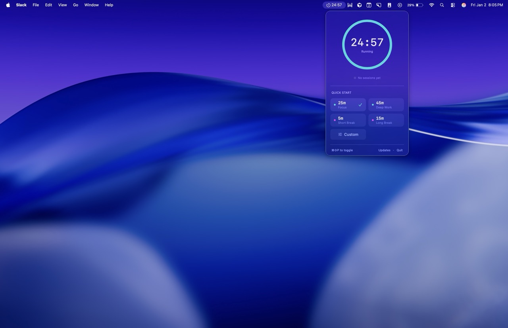

<p align="center">
  
</p>

<h1 align="center">Pomo</h1>

<p align="center">
  <strong>A minimal, elegant Pomodoro timer for your macOS menu bar.</strong>
</p>

<p align="center">
  <a href="https://github.com/claudfuen/Pomo/releases/latest"></a>
  
  
  <a href="LICENSE"></a>
</p>

<p align="center">
  <a href="https://github.com/claudfuen/Pomo/releases/latest/download/Pomo.dmg">
    
  </a>
</p>

<p align="center">
  
  &nbsp;&nbsp;
  
</p>

---

## Why Pomo?

Most Pomodoro apps are bloated, distracting, or require too many clicks. **Pomo** is different:

- 🪶 **Lightweight** — No dock icon, no window clutter. Just your menu bar.
- ⚡ **Fast** — One click to start. Global hotkey to control from anywhere.
- 🎯 **Focused** — Does one thing exceptionally well.
- 🍎 **Native** — Built with SwiftUI, feels right at home on macOS.

---

## Features

<table>
<tr>
<td width="50%">

### 🎯 Focus Modes
Four built-in presets optimized for productivity:
- **Focus** — 25 minutes
- **Deep Work** — 45 minutes  
- **Short Break** — 5 minutes
- **Long Break** — 15 minutes

Plus custom durations for any workflow.

</td>
<td width="50%">

### ⌨️ Keyboard First
Control everything without touching your mouse:
- `⌘⇧P` — Toggle timer globally
- `Space` — Start/pause in popover
- Click timer ring to toggle

</td>
</tr>
<tr>
<td width="50%">

### 📊 Session Tracking
Keep track of your daily progress:
- Automatic session counting
- Resets at midnight
- Persists across app restarts

</td>
<td width="50%">

### 🔔 Smart Notifications
Know when you're done:
- Native macOS notifications
- Gentle completion sound
- Visual celebration animation

</td>
</tr>
</table>

### Visual Feedback

The timer ring changes color as time runs out:

| State | Color | Meaning |
|-------|-------|---------|
| 🟢 | **Teal** | Plenty of time remaining |
| 🟡 | **Amber** | Less than 40% remaining |
| 🔴 | **Red** | Final stretch (<20%) |
| ✅ | **Green** | Session complete! |

---

## Installation

### Download (Recommended)

1. Download the latest [**Pomo.dmg**](https://github.com/claudfuen/Pomo/releases/latest/download/Pomo.dmg)
2. Open the DMG and drag **Pomo** to your Applications folder
3. Launch Pomo — it will appear in your menu bar

> **Note:** On first launch, you may need to right-click and select "Open" to bypass Gatekeeper, since the app is not notarized.

### Build from Source

```bash
# Clone the repository
git clone https://github.com/claudfuen/Pomo.git
cd Pomo

# Build release version
xcodebuild -project Pomo.xcodeproj -scheme Pomo -configuration Release \
  MACOSX_DEPLOYMENT_TARGET=14.0 build

# The app will be in ~/Library/Developer/Xcode/DerivedData/Pomo-*/Build/Products/Release/
```

**Requirements:**
- macOS 14.0 (Sonoma) or later
- Xcode 15.0+ (for building from source)

---

## Usage

1. **Click the timer icon** in your menu bar to open Pomo
2. **Select a preset** or set a custom duration
3. **Click the timer ring** or press `Space` to start
4. **Stay focused** until the notification arrives
5. **Repeat** — your session count will update automatically

> 💡 **Pro tip:** Use `⌘⇧P` to pause/resume without opening the popover.

---

## Tech Stack

| Technology | Purpose |
|------------|---------|
| **SwiftUI** | Declarative UI framework |
| **Combine** | Reactive timer management |
| **MenuBarExtra** | Native menu bar integration |
| **HotKey** | Global keyboard shortcuts |
| **UserNotifications** | Native notification delivery |

---

## Project Structure

```
Pomo/
├── PomoApp.swift              # Entry point & menu bar setup
├── ViewModels/
│   └── TimerManager.swift     # Timer logic, state, persistence
├── Views/
│   ├── PopoverView.swift      # Main container
│   ├── TimerRingView.swift    # Animated progress ring
│   ├── PresetsView.swift      # Quick start buttons
│   ├── CustomTimeView.swift   # Duration picker
│   └── SessionCounterView.swift
├── Models/
│   ├── TimerState.swift       # State enum (idle/running/paused/completed)
│   └── TimerPreset.swift      # Preset definitions
├── Managers/
│   └── SoundManager.swift     # Completion sounds
└── Extensions/
    └── Color+Theme.swift      # Color palette
```

---

## Contributing

Contributions are welcome! Here's how:

1. **Fork** the repository
2. **Create** a feature branch (`git checkout -b feature/amazing`)
3. **Commit** your changes (`git commit -m 'Add amazing feature'`)
4. **Push** to the branch (`git push origin feature/amazing`)
5. **Open** a Pull Request

### Ideas for Contributions

- [ ] Menu bar icon customization
- [ ] Statistics/history view
- [ ] iCloud sync for session data
- [ ] Customizable sounds
- [ ] Auto-start break after focus session

---

## Releasing

### Version Numbers

Use [semantic versioning](https://semver.org/) (`vMAJOR.MINOR.PATCH`):

| Change Type | Example | When to Use |
|-------------|---------|-------------|
| **PATCH** | `v1.0.0` → `v1.0.1` | Bug fixes, small tweaks |
| **MINOR** | `v1.0.1` → `v1.1.0` | New features (backward compatible) |
| **MAJOR** | `v1.1.0` → `v2.0.0` | Breaking changes, major redesign |

Check the current version:
```bash
git tag --sort=-v:refname | head -1
```

### Create a Release

```bash
git tag v1.0.1
git push origin v1.0.1
```

That's it! GitHub Actions will automatically build the app, create a DMG, update the appcast, and publish to [Releases](https://github.com/claudfuen/Pomo/releases).

---

## License

MIT License — see [LICENSE](LICENSE) for details.

---

## Acknowledgments

- Inspired by the [Pomodoro Technique®](https://francescocirillo.com/products/the-pomodoro-technique) by Francesco Cirillo
- [HotKey](https://github.com/soffes/HotKey) by Sam Soffes

---

<p align="center">
  <sub>Built with ☕️ by <a href="https://github.com/claudfuen">@claudfuen</a></sub>
</p>
